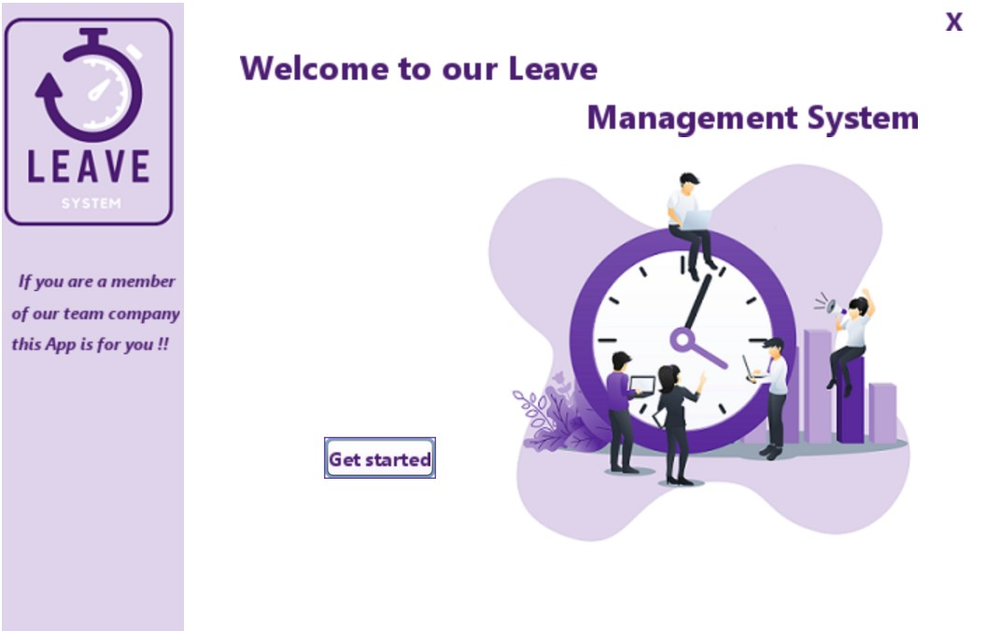

# LeaveSystem - Application de Gestion des Congés en Java

**LeaveSystem** est une application de bureau développée en Java avec Swing et JDBC, permettant d'automatiser la gestion des demandes de congés des employés au sein d'une entreprise : gestion des employés, demandes de congés, approbations, authentification sécurisée et historique des actions.

---

## 📁 Structure du projet

```
LeaveSystem/
├── build/
│   ├── classes/
│   │   ├── btn/          # Composants bouton personnalisés
│   │   ├── com/          # Classes principales du projet
│   │   ├── historique/   # Gestion des historiques de congés
│   │   └── icon/         # Ressources d'icônes
│   ├── empty/
│   └── generated-sources/
│       └── ap-source-output/
├── DataBase/             # Scripts SQL et base de données
├── dist/
│   └── lib/              # Bibliothèques nécessaires à l'exécution
├── nbproject/            # Fichiers de configuration NetBeans
│   └── private/
├── src/
│   ├── btn/              # Code source des boutons
│   ├── com/              # Code source principal de l'application
│   ├── historique/       # Module d'historique des demandes
│   └── icon/             # Images et icônes de l'interface
└── test/                 # Dossier de tests unitaires
```

---

## 📷 Aperçu des interfaces

### 🔑 Interface de connexion
- Authentification sécurisée pour employés et administrateurs
- Validation des identifiants dans MySQL
  

### 🧑‍💼 Interface Employé
- Visualiser les types de congés disponibles
- Consulter le solde restant
- Soumettre une nouvelle demande de congé
- Imprimer ses demandes

### 🛠 Interface Administrateur
- Gérer les employés (ajout, édition, suppression)
- Valider ou rejeter les demandes de congés
- Impression des listes d'employés et des congés validés
- Envoi automatique d'email après décision

---

## 🎯 Fonctionnalités principales

| Module               | Fonctionnalités clés                                   |
|----------------------|--------------------------------------------------------|
| 🔐 Authentification   | Connexion sécurisée (email et mot de passe)            |
| 🧑‍💼 Gestion Employés  | Ajouter, modifier, supprimer, rechercher employés     |
| 🛫 Gestion Congés      | Soumettre, visualiser, approuver/rejeter des congés    |
| 🖨 Impression          | Impression de listes et d'attestations                |
| 📧 Notification Email | Envoi d'email après validation ou rejet de demande    |

---

## 🛠️ Technologies utilisées

- Java 8+
- Swing – pour les interfaces graphiques
- JDBC – pour la connexion MySQL
- MySQL – base de données de gestion
- XAMPP – serveur local (Apache + MySQL)
- WebSwing – pour rendre l'application accessible via navigateur (optionnel)
- NetBeans IDE

---

## ⚙️ Installation & Exécution

✅ **Prérequis :**
- Java Development Kit (JDK)
- Serveur XAMPP (MySQL actif)
- NetBeans IDE

🚀 **Étapes d'installation :**

```bash
# Cloner le projet
git clone https://github.com/Omayma77/gestion-des-conges.git
cd gestion-des-conges
```

- Importer le projet dans **NetBeans IDE**.
- Configurer la base de données avec les scripts SQL depuis `/DataBase/`.
- Lancer `Login.java` pour démarrer l'application.

---

## 👩‍💻 Auteurs

- **Omayma Harchich**
- **Kawtar Gantouh**

---

## 📄 Licence

Projet réalisé dans un cadre académique - Utilisation libre avec attribution.

---

## ✅ Conclusion

**LeaveSystem** propose une solution moderne et performante pour simplifier la gestion administrative des congés.  
Ergonomique, rapide et fiable, il répond aux besoins des RH en matière d'organisation et de suivi du personnel.

⭐ Pensez à noter ⭐ ou partager ce projet si vous le trouvez utile !

---
